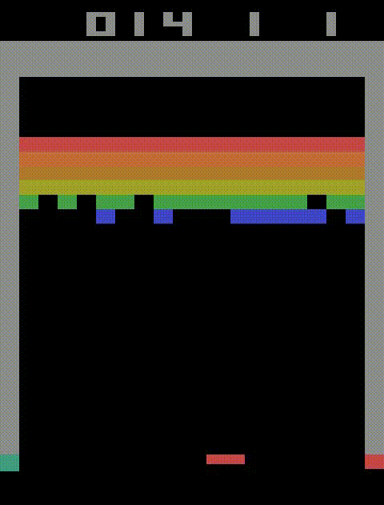
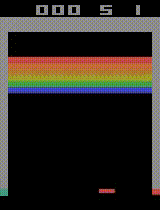
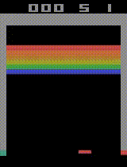
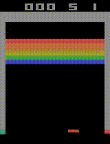
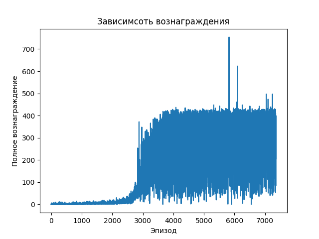
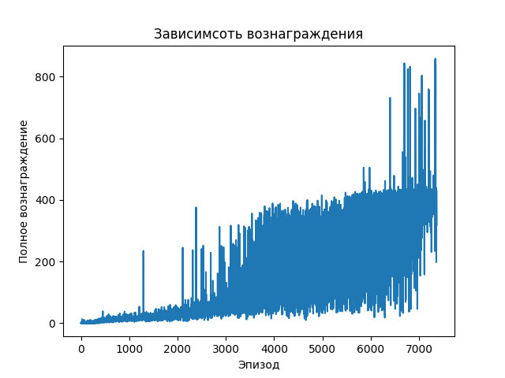

# Учебный проект в рамках изучения обучения с подкреплением 


## [Breakout](https://www.gymlibrary.dev/environments/atari/breakout/)


<p align="center">

</p>

## Описание

Еще одна известная игра Atari. Динамика похожа на понг: вы перемещаете ракетку и ударяете мячом по кирпичной стене в верхней части экрана. Ваша цель — разрушить кирпичную стену.

### Действия

- 0 - ничего не делать
- 1 - ударить по мячу
- 2 - сдвинуться вправо
- 3 - сдвинуть влево

### Cреда возращает:
- изображение
- boolean значение терменального состояния
- дополнительную информацую (число жизней)

### Награды среды
Награда начисляется за разбиение кирпичей по слоям начиная сверху:
- блоки с 1 и 2 слоя - 7
- блоки с 3 и 4 слоя - 4
- блоки с 5 и 6 слоя - 1

# Установка

Создать окружение python 3.11
```
python -3.11 -m venv venv
venv\Scripts\activate
pip install -r req.txt
```
# Оценка моделей
Рассматрицваются математическое ожидание, среднеквадротичное отклонение и дисперсия.

Строится доверительный интервал значимости $\alpha$ для математического ожидания при неизвестной дисперсии:
$I_a = [\overline{x} - \frac{S}{\sqrt{n - 1}} * t_{n - 1}, \overline{x} + \frac{S}{\sqrt{n - 1}} * t_{n - 1} ]$

# Первые результаты	

Использовался алгоритм Q - обучение с аппроксимацией функции нейронной сетью с применением буфера воспроизведения опыта.

Политика определяется $\epsilon$ - жадной стратегией. 

## Результат эксперимента для первой модели (24)

### Точечные оценки для J
 - Выборочное среднее: $17.35$;
 - Выборочное среднеквадратичное отклонение: $8.16$;
 - Выборочная дисперсия: $66.57$

### Интервальная оценка для J 

С вероятностью $0.95$ матожидание лежит в интервале $[ 15.23, 19.47]$

<p align="center">

</p>


## Результат эксперимента для второй модели (20)

### Точечные оценки для J
 - Выборочное среднее: $17.08$;
 - Выборочное среднеквадратичное отклонение: $7.06$;
 - Выборочная дисперсия: $49.78$

### Интервальная оценка для J 

С вероятностью $0.95$ матожидание лежит в интервале $[ 15.25, 18.92]$

<p align="center">

</p>

# Deep Q Network (DQN)

На текущем этапе были выбраны для тестирования 3 алгоритма Reinforce, Actor-Critic и DQN. По результатам облучения, выбор пал на алгоритм DQN, т.к. другие алгоритмы не фиксировали текущий уровень резултатов, из-за чего постоянно результаты падали до 0. В свою очередь DQN имеет вторую опорную модель поддреживающую уровень.

## Результат эксперимента для первой модели (754)

### Точечные оценки для J
 - Выборочное среднее: $254.93$;
 - Выборочное среднеквадратичное отклонение: $57.22$;
 - Выборочная дисперсия: $3273.79$

### Интервальная оценка для J 

- С вероятностью $0.9$ матожидание лежит в интервале $[ 242.48, 267.37]$
- С вероятностью $0.95$ матожидание лежит в интервале $[ 240.03, 269.83]$

<p align="center">

</p>

## Результат эксперимента для второй модели (full)

### Точечные оценки для J
 - Выборочное среднее: $399.20$;
 - Выборочное среднеквадратичное отклонение: $10.04$;
 - Выборочная дисперсия: $100.96$

### Интервальная оценка для J 

- С вероятностью $0.9$ матожидание лежит в интервале $[ 397.01, 401.38]$
- С вероятностью $0.95$ матожидание лежит в интервале $[ 396.58, 401.81]$

<p align="center">

</p>

# Proximal Policy Optimization (PPO)

Данный алгоритм обучения был выбран

Использовалась модель PPO, в которой к основной loss функции прибалвялись ошибки кросс-энтропии и MSE.

Для ускорения процесса обучения добавлена возможность паралельного выполнения нескольких игр. Их результаты объединяются в батч и подаются на обучение.

## Результат эксперимента для первой модели (859)

### Точечные оценки для J
 - Выборочное среднее: $452.82$;
 - Выборочное среднеквадратичное отклонение: $107.28$;
 - Выборочная дисперсия: $11507.92$

### Интервальная оценка для J 

- С вероятностью $0.9$ матожидание лежит в интервале $[ 429.48, 476.15]$
- С вероятностью $0.95$ матожидание лежит в интервале $[ 424.88, 480.75]$

<p align="center">

</p>

## Результат эксперимента для второй модели (full)

### Точечные оценки для J
 - Выборочное среднее: $411.33$;
 - Выборочное среднеквадратичное отклонение: $88.37$;
 - Выборочная дисперсия: $7809.09$

### Интервальная оценка для J 

- С вероятностью $0.9$ матожидание лежит в интервале $[ 392.11, 430.55]$
- С вероятностью $0.95$ матожидание лежит в интервале $[ 388.32, 434.34]$

<p align="center">

</p>

# Результаты экспериментов


<div align="center">
    <h3>График обучения DQN</h3>
    
    <h3>График обучения PPO</h3>
    
</div>

Сравнивая интервальные оценки и графики обучения разных моделей, можно прийти к следующим выводам:
- DQN оказался требовательней по ресурсам и времени для обучения, т.к. работают сразу 2 модели и требует достаточный объем ОЗУ для сохранения шагов в буфер (из-за этих ограничений не удалось обучаться с параллельными играми) - **обучение заняло 13 часов**;
- PPO в сравнении с DQN не требовал так много ресурсов и времени для обучения (существенно на это повлияло возможность обучать с парараллельными играми) - **обучение заняло 4 часа**;
- по графикам можно предположить, что DQN достиг своего максимума при заданных параметрах обучения, а PPO имеет потенциал для дальнейшего улучшения качества.

# Литература
1. Обучение с подкреплением на PyTorch: сборник рецептов - Юси (Хайден) Лю
2. <a href="https://gymnasium.farama.org/main">Документация Gymnasium</a>
3. <a href="https://github.com/vwxyzjn/cleanrl">Источник вдохновения</a>