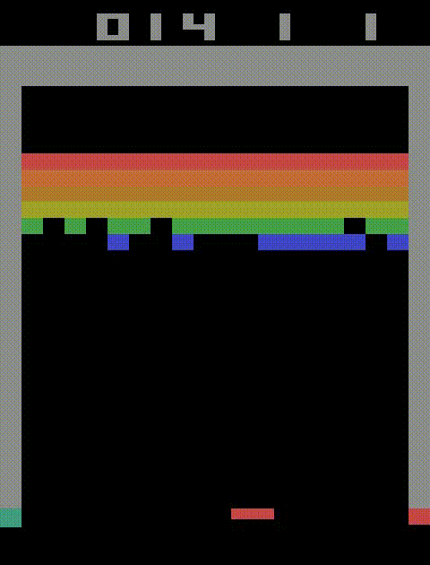
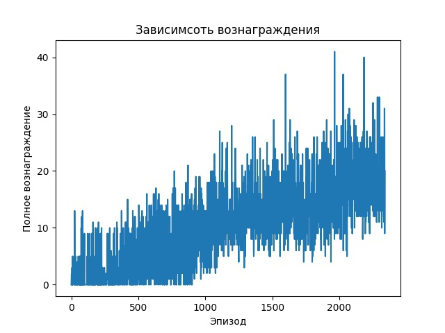

# Учебный проект в рамках изучения обучения с подкреплением 


## [Breakout](https://www.gymlibrary.dev/environments/atari/breakout/)


<p align="center">

</p>

## Описание

Еще одна известная игра Atari. Динамика похожа на понг: вы перемещаете ракетку и ударяете мячом по кирпичной стене в верхней части экрана. Ваша цель — разрушить кирпичную стену.

### Действия

- 0 - ничего не делать
- 1 - ударить по мячу
- 2 - сдвинуться вправо
- 3 - сдвинуть влево

### Cреда возращает:
- изображение
- boolean значение терменального состояния
- дополнительную информацую (число жизней)

### Награды среды
Награда начисляется за разбиение кирпичей по слоям начиная сверху:
- блоки с 1 и 2 слоя - 7
- блоки с 3 и 4 слоя - 4
- блоки с 5 и 6 слоя - 1

# Установка

Требуется наличие openssl

Создать окружение python 3.11
```
python -3.11 -m venv venv
venv\Scripts\activate
pip install -r req.txt
```
# Оценка моделей
Рассматрицваются математическое ожидание, среднеквадротичное отклонение и дисперсия.

Строится доверительный интервал значимости $\alpha$ для математического ожидания при неизвестной дисперсии:
$I_a = [\overline{x} - \frac{S}{\sqrt{n - 1}} * t_{n - 1}, \overline{x} + \frac{S}{\sqrt{n - 1}} * t_{n - 1} ]$

# Value based	

Q - обучение с аппроксимацией функции нейронной сетью с применением буфера воспроизведения опыта.

Политика определяется $\epsilon$ - жадной стратегией. 

## Результат эксперимента для первой модели (24)

### Точечные оценки для J
 - Выборочное среднее: $17.35$;
 - Выборочное среднеквадратичное отклонение: $8.16$;
 - Выборочная дисперсия: $66.57$

### Интервальная оценка для J 

С вероятностью $0.95$ матожидание лежит в интервале $[ 15.23, 19.47]$

<p align="center">

</p>


## Результат эксперимента для второй модели (20)

### Точечные оценки для J
 - Выборочное среднее: $17.08$;
 - Выборочное среднеквадратичное отклонение: $7.06$;
 - Выборочная дисперсия: $49.78$

### Интервальная оценка для J 

С вероятностью $0.95$ матожидание лежит в интервале $[ 15.25, 18.92]$

<p align="center">

</p>

# Policy based (PG)

Использовалась модель Proximal Policy Optimization (PPO), в которой к основной loss функции прибалвялись ошибки кросс-энтропии и MSE.

Для ускорения процесса обучения добавлена возможность паралельного выполнения нескольких игр. Их результаты объединяются в батч и подаются на обучение.

Получившиеся модели являются результатом параллельного обучения 8 игр в течении 40 минут
<p align="center">

</p>

По графику видно, что результаты обучения постепенно увеличиваются

## Результат эксперимента для первой модели (full)

### Точечные оценки для J
 - Выборочное среднее: $13.05$;
 - Выборочное среднеквадратичное отклонение: $3.12$;
 - Выборочная дисперсия: $9.71$

### Интервальная оценка для J 

С вероятностью $0.95$ матожидание лежит в интервале $[ 12.24, 13.86]$

<p align="center">

</p>

## Результат эксперимента для второй модели (.41)

### Точечные оценки для J
 - Выборочное среднее: $14.1$;
 - Выборочное среднеквадратичное отклонение: $3.12$;
 - Выборочная дисперсия: $9.71$

### Интервальная оценка для J 

С вероятностью $0.95$ матожидание лежит в интервале $[ 12.24, 13.86]$

<p align="center">

</p>
